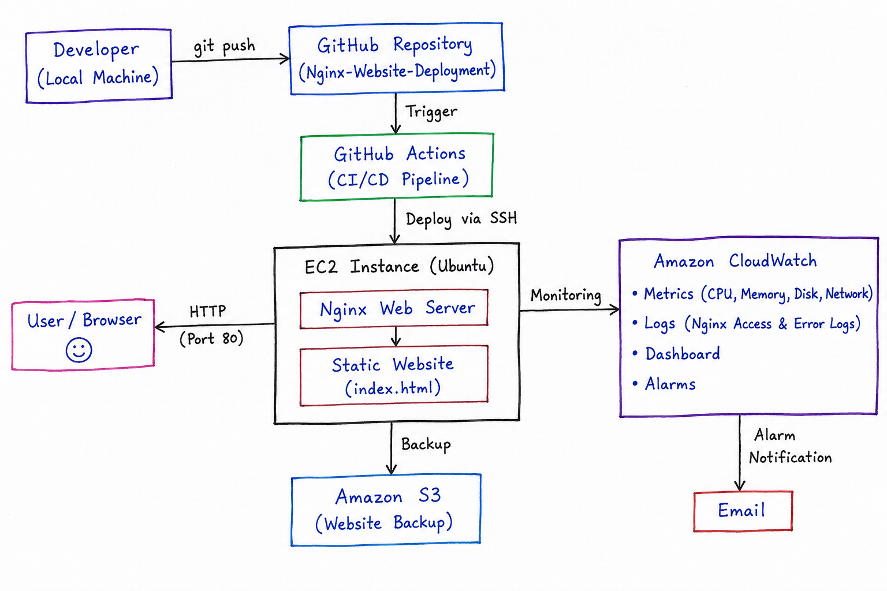

# AWS Web Server Deployment with CI/CD, Monitoring, Backup & Load Testing

A production-style DevOps project demonstrating the deployment of a web server on AWS using modern DevOps practices.

## Project Overview

This project demonstrates how to deploy a static website on an Ubuntu EC2 instance using Nginx and automate deployments with GitHub Actions. It also includes automated Amazon S3 backups, IAM role-based access, CloudWatch monitoring, dashboards, alarms, centralized log collection, and load testing using k6.

## Architecture Diagram



## Technologies Used

- AWS EC2
- Ubuntu Linux
- Nginx
- Git & GitHub
- GitHub Actions
- Amazon S3
- AWS IAM
- Amazon CloudWatch
- k6
- Bash

## Features

- Deploy website on AWS EC2
- Configure Nginx web server
- CI/CD pipeline using GitHub Actions
- Automated website deployment
- Automated daily backup to Amazon S3
- IAM role-based permissions
- CloudWatch metrics and dashboards
- CloudWatch alarms
- CloudWatch log collection
- Load testing with k6
- Performance monitoring

## Repository Structure

```
.
├── .github/
│   └── workflows/
│       └── deploy.yml
├── index.html
├── README.md
└── AWS-Web-Server-Deployment-CI-CD-Monitoring-Backup-Load-Testing.pdf
```

## Documentation

The complete project documentation, including implementation steps, architecture, configuration, monitoring, screenshots, and performance testing, is available in the PDF below.

**📄 AWS-Web-Server-Deployment-CI-CD-Monitoring-Backup-Load-Testing.pdf**

## Key Learning Outcomes

- AWS EC2 deployment
- Linux server administration
- Nginx configuration
- GitHub Actions CI/CD
- AWS IAM
- Amazon S3 backups
- CloudWatch monitoring
- Infrastructure monitoring
- Log management
- Performance testing with k6

## Author

**Satyajeet**

DevOps | AWS | Linux | CI/CD
